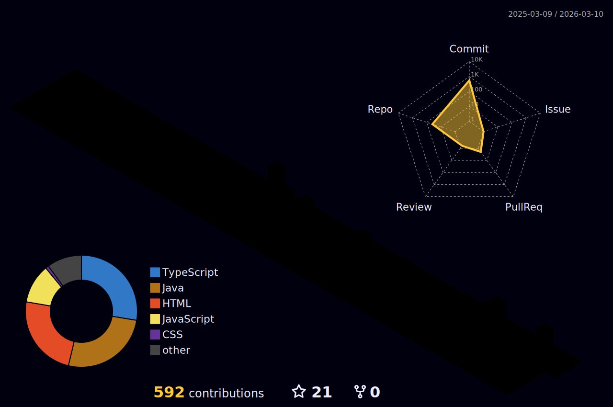

  

<h3 align="center">A passionate Full Stack Developer from India 🇮🇳</h3>

  

  
  

  
  
  
  
  
  

 

  Let's connect and build something amazing together! 🚀

  

 

### 👨‍💻 About Me

- 🔭 I’m currently working on **Full Stack Web Development**
- 🌱 I’m currently learning **Microservices, React 18, JWT Authentication**
- 👯 I’m looking to collaborate on **Open Source Projects**
- 💬 Ask me about **Spring Boot, React, Java, JavaScript**
- 📫 How to reach me: **imrajeevnayan@gmail.com**
- ⚡ Fun fact: **I think coding is like magic – turning coffee into code! ☕**

---

### 🏆 Achievements

  

---

### 🚀 My Tech Stack

| **Frontend** | **Backend** | **Database** | **DevOps & Tools** |
|:---:|:---:|:---:|:---:|
|  |  |  |  |
|  |  |  |  |
|  |  |  |  |
|  |  |  |  |

---

### 📊 GitHub Stats

 

 

<!-- 3D Contrib Graph - Generated by Workflow -->

 

<picture>
  <source media="(prefers-color-scheme: dark)" srcset="https://raw.githubusercontent.com/imrajeevnayan/imrajeevnayan/output/github-contribution-grid-snake-dark.svg">
  <source media="(prefers-color-scheme: light)" srcset="https://raw.githubusercontent.com/imrajeevnayan/imrajeevnayan/output/github-contribution-grid-snake.svg">
  
</picture>

---

### 🏆 Featured Projects

| Project | Description | Tech Stack |
| :--- | :--- | :--- |
| **[rajeevnayan](https://github.com/imrajeevnayan/rajeevnayan)** | 🎨 My personal portfolio showcasing specific skills and projects. | `TypeScript` `React` |
| **[restaurant-website](https://github.com/imrajeevnayan/restaurant-website)** | 🍔 A fully responsive restaurant website with modern UI/UX. | `HTML` `CSS` `JS` |
| **[Rento](https://github.com/imrajeevnayan/Rento)** | 🏠 Rental platform featuring Google OAuth integration for secure login. | `React` `Google OAuth` |
| **[readmify](https://github.com/imrajeevnayan/readmify)** | 📝 An AI-powered tool to generate beautiful README files. | `AI` `Node.js` |
| **[Chatgpt-Clone](https://github.com/imrajeevnayan/Chatgpt-Clone)** | 🤖 A clone of ChatGPT built to understand LLM integration. | `TypeScript` `OpenAI API` |

---

  

